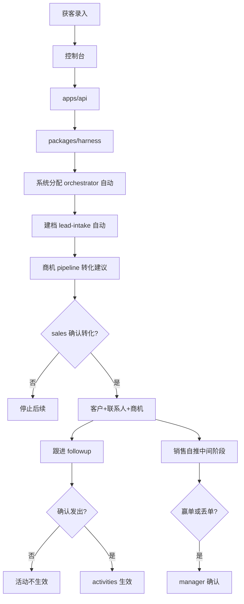
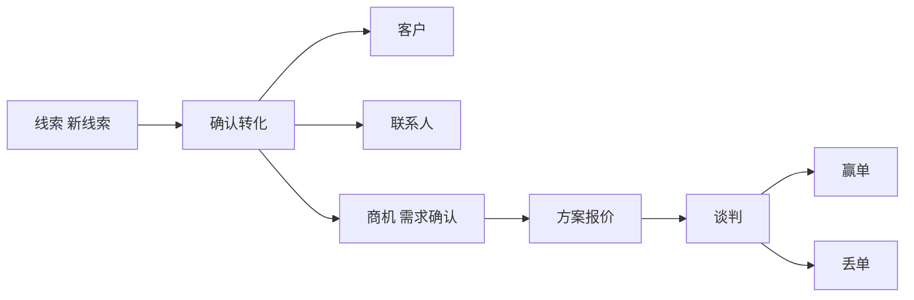
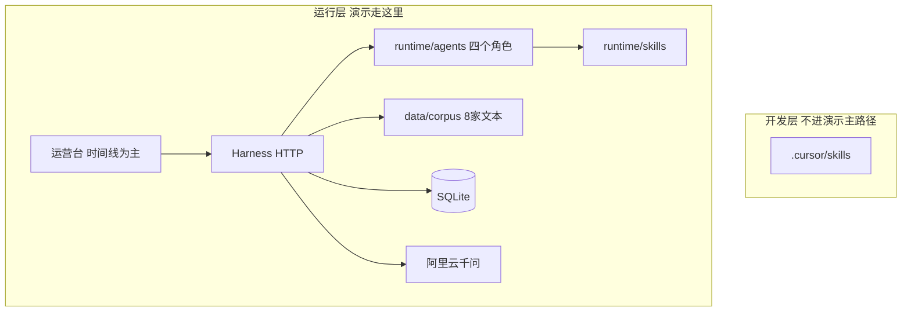
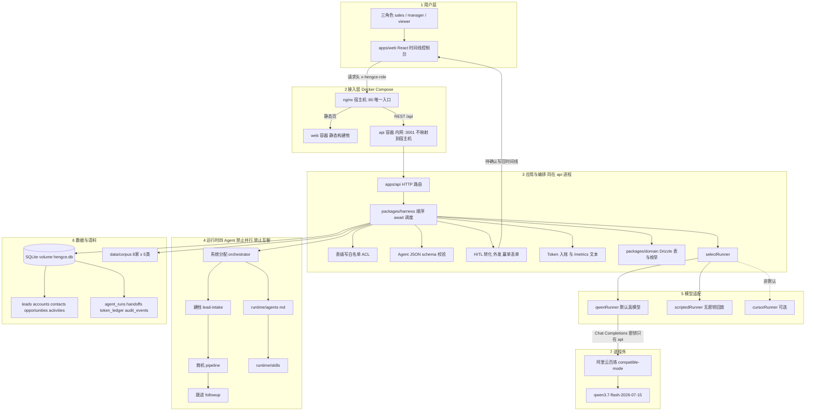
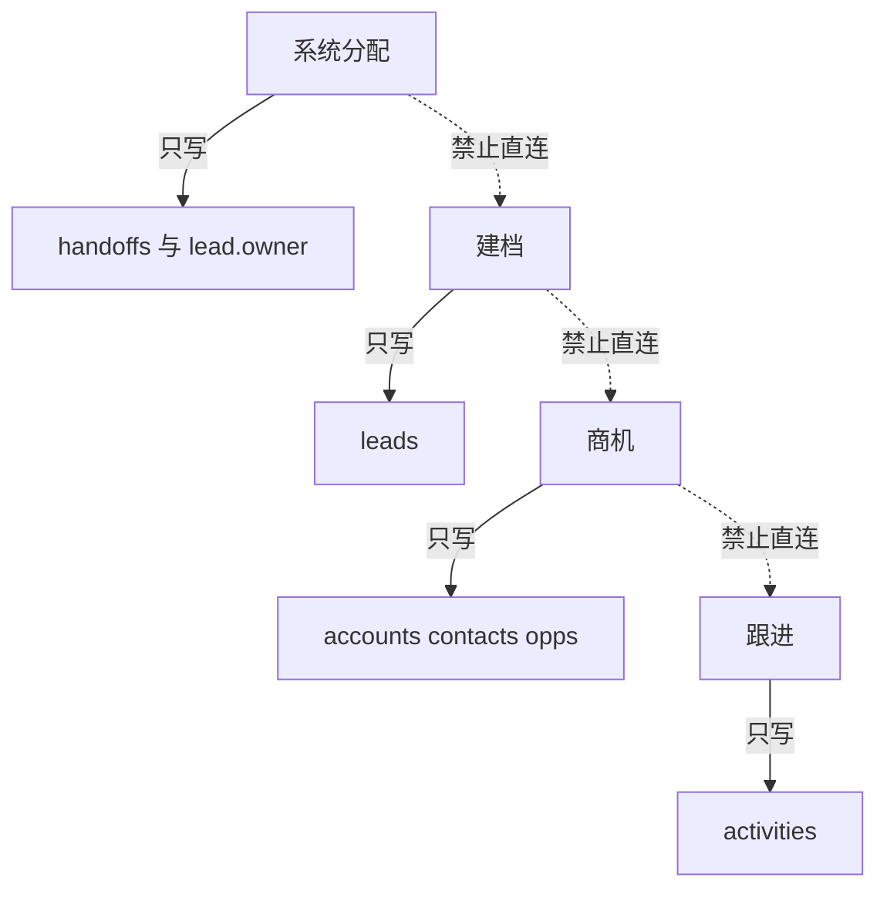
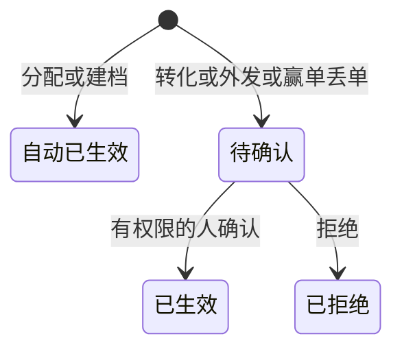

# 衡策销管平台

卖销售系统的公司使用的 **CRM harness 多智能体控制台**。获客后四个 Agent 按序交卷：系统分配、建档、商机（转化/阶段）、跟进活动；客户+联系人+商机分开；转化与外发由销售确认，赢单/丢单由经理确认。

完整需求：[docs/PRD.md](docs/PRD.md) · 技术对错：[docs/tech-selection.md](docs/tech-selection.md) · 评估：[docs/eval.md](docs/eval.md) · 工程约定：[docs/engineering-standards.md](docs/engineering-standards.md) · Skill 时间线：[docs/skill-timeline.md](docs/skill-timeline.md) · 点击原型：[docs/frontend-demo.md](docs/frontend-demo.md) · 当前契约：[docs/contracts/S9.md](docs/contracts/S9.md) · 开发交接：[docs/cursor-session-handoff.md](docs/cursor-session-handoff.md)

## 技术选型（摘要）

| 采用 | 薄做 | 首版不做 |
|---|---|---|
| Vite+React、SQLite+Drizzle、Docker、顺序四 Agent、HITL/HOTL、Token 台账、逻辑沙箱、上下文组装、可回溯 handoff | nginx 反代、三角色权限、`/metrics` 预留、护栏（schema+ACL） | Redis、RabbitMQ、独立 Prometheus+Grafana、GraphRAG、独立向量库、K8s、电销、充值套餐 |

课程若**点名** Redis / RabbitMQ / Grafana，按 tech-selection 里的薄切片加，不改主链路。

## 系统流程图



## 业务流程图



黄金切片：橙果获客 → 系统分配 → 建档 → 确认转化 → 确认发出电话活动。报价/合同不做。相似：杭齿精密机电 ↔ 嘉兴精工装备；邻里鲜超市 ↔ 夜灯便利。

## 逻辑架构图



开发层 skill 不进运行时加载路径。默认真模型是千问；Cursor SDK 可选，不是主路径。

## 技术实现架构图



老师看图时可以按 1→7 讲：浏览器只打 80 端口；nginx 把页面和 API 拆开；四个 CRM Agent 在 harness 里顺序交卷，不直连、不暴露端口；有密钥走千问，没有密钥仍能 scripted 回放种子；SQLite 刷新不丢；前端包里没有模型密钥。首版不做 Redis、RabbitMQ、独立 Grafana、K8s。本地开发时 Vite 把 `/api` 反代到 `127.0.0.1:3001`，不经 nginx。

## 多智能体沙箱（逻辑隔离）



虚线表示禁止直连。越权工具调用进 `audit_events` 并拒绝。

## 人机协同



中间商机阶段销售直接推进。HOTL：可 abort；历史 handoff 不改写。

## 接口设计

| 方法 | 路径 | 说明 |
|---|---|---|
| POST | `/api/leads/ingest` | 录入线索，顺序跑系统分配→建档→转化建议；确认转化后才跟进 |
| GET | `/api/leads` | 列表 |
| GET | `/api/leads/:id` | 卡片 + 时间线 |
| POST | `/api/handoffs/:id/confirm` | 确认 |
| POST | `/api/handoffs/:id/reject` | 拒绝 |
| POST | `/api/leads/:id/stage` | 推进阶段；赢单/丢单待经理确认 |
| POST | `/api/leads/:id/abort` | 按线索中止排队 |
| POST | `/api/runs/:id/abort` | 按 run 中止排队 |
| GET | `/api/handoffs/pending` | 跨线索待确认 |
| GET | `/api/similar?company=` | 相似客户（sqlite-vec） |
| GET | `/api/usage` | Token 合计 |
| GET | `/api/metrics` | Prometheus 文本预留 |
| GET | `/api/health` | 存活 |

鉴权按 `sales` / `manager` / `viewer`。路径与语义以契约为准，未另写 OpenAPI。不得把 Agent 端口暴露给前端。

## 目录（实现后）

```text
apps/web
apps/web-demo
apps/api
packages/harness
packages/domain
runtime/agents
runtime/skills
data/corpus
docs/
```

## 本地与评估

库与语料（M1）+ harness（M2）：

```text
npm install
npm test
npm run test:golden    # 无密钥则跳过
npm run eval:report    # 生成 docs/eval-last-run.md
npm run db:seed
npm --prefix apps/api start
```

本地真模型：复制 `.env.example` 为仓库根 `.env`，自己填 `DASHSCOPE_API_KEY`。不要把密钥写进前端或提交进 git。

无后端点击原型（M0.5）：

```text
npm --prefix apps/web-demo install
npm --prefix apps/web-demo test
npm --prefix apps/web-demo run dev
```

真控制台（M3）：

```text
npm --prefix apps/api start
npm --prefix apps/web install
npm --prefix apps/web test
npm --prefix apps/web run dev
```

浏览器打开 Vite 提示的端口。默认是橙果的漏斗交卷轨。确认转化 → 确认发出。杭齿：建议赢单须切经理。不要把 web-demo 接 API。

Docker（M4，唯一入口 :80）：

```text
docker compose up --build
```

打开 http://127.0.0.1/ 。无 Redis、无 MQ。无密钥默认 scripted，可回放种子；有 `DASHSCOPE_API_KEY` 自动走千问。

## 8 家客户

杭齿精密机电、嘉兴精工装备、澄海医疗器械、橙果素质教育、邻里鲜超市、夜灯便利、海图进出口、江东水务物资。详情见 PRD。
